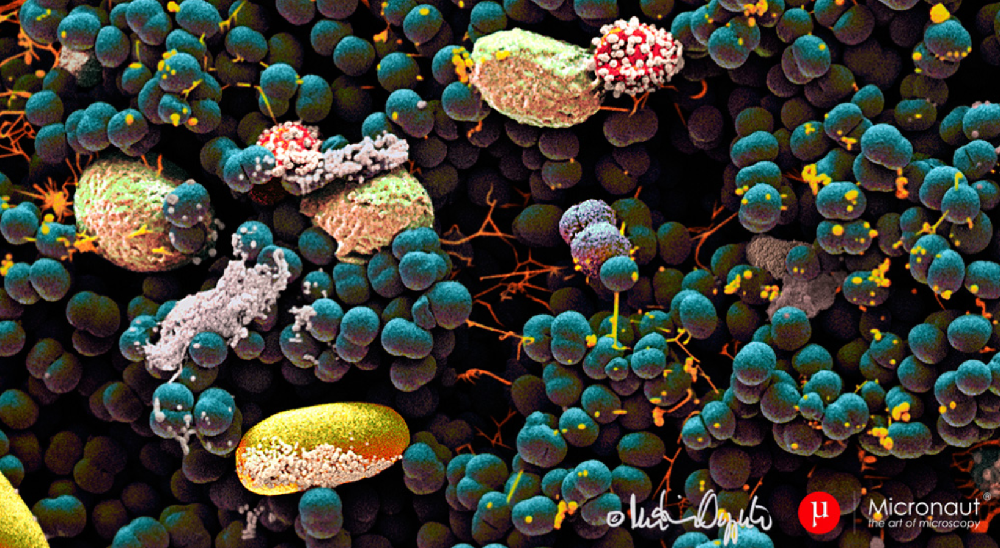
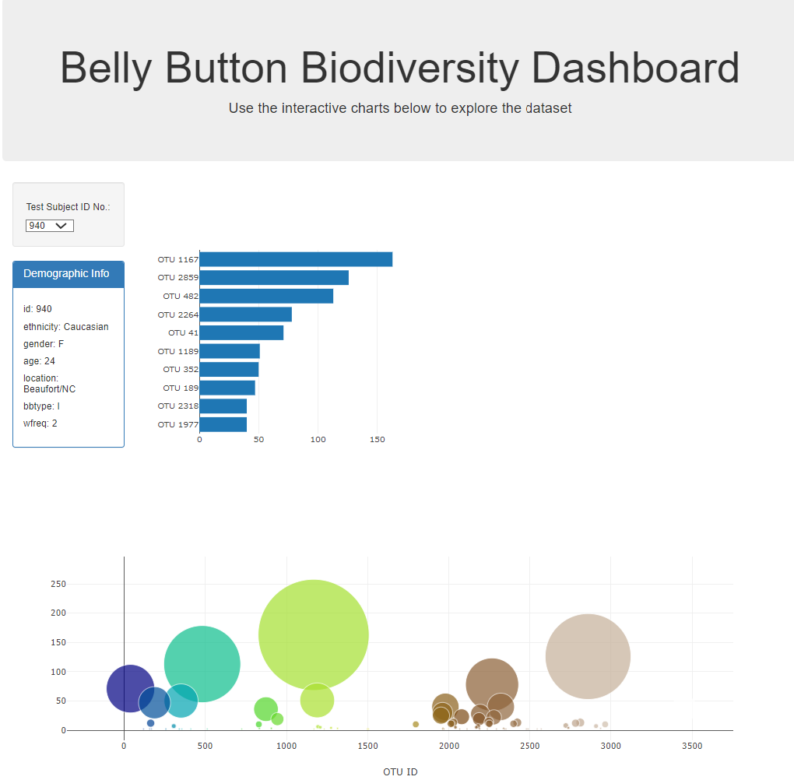

# belly-button-challenge

# Belly Button Biodiversity

## The coolest study of biodiversity on the human body on the planet!
The belly button is one of the habitats closest to us, and yet it remains relatively unexplored. In January 2011, we launched Belly Button Biodiversity to investigate the microbes inhabiting our navels and the factors that might influence the microscopic life calling this protected, moist patch of skin home. 
In addition to inspiring scientific curiosity, Belly Button Biodiversity inspired conversations about the beneficial roles microbes play in our daily lives.

In this assignment, you will build an interactive dashboard to explore the Belly Button Biodiversity datasetLinks to an external site., which catalogs the microbes that colonize human navels.
The dataset reveals that a small handful of microbial species (also called operational taxonomic units, or OTUs, in the study) were present in more than 70% of people, while the rest were relatively rare.

